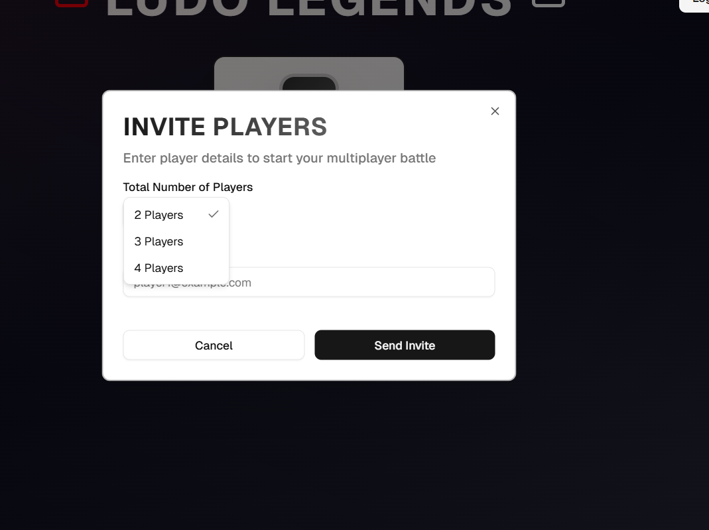
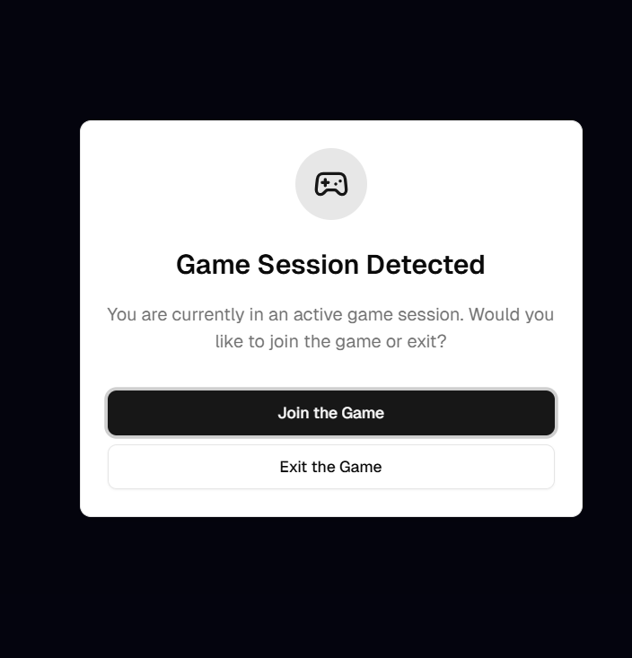
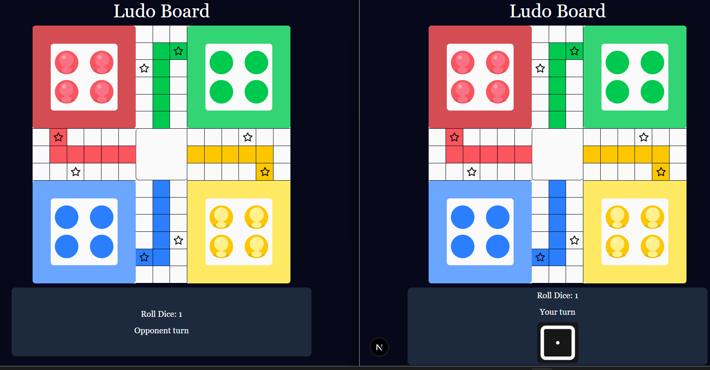

<!-- ================= IMAGES ================= -->

  
  
  

<h2>🎮 Real-Time Multiplayer Ludo Game</h2>

A fully server-authoritative, real-time multiplayer Ludo game built from scratch with a
custom game engine, WebSocket networking, and Redis-backed state management.

<h3>🎥 Video Demos</h3>
<ul>
  <li><a href="https://www.linkedin.com/feed/update/urn:li:activity:7407095633913839616/">Video 1</a></li>
  <li><a href="https://x.com/rishang_14/status/2001567119595708862">Video 2</a></li>
  <li><a href="https://www.linkedin.com/feed/update/urn:li:ugcPost:7407339302994706432/">Vidoe 3</a></li>
  <li><a href="https://x.com/rishang_14/status/2001577417958396350">video 4</a></li>
</ul>

<h3>🧠 Core Highlights</h3>
<ul>
  <li>Designed a complete Ludo game engine with turn-based rules, dice logic, and move validation</li>
  <li>Implemented real-time multiplayer sync using WebSockets with strict game-room isolation</li>
  <li>Built server-authoritative gameplay to prevent cheating and invalid moves</li>
  <li>Modeled board state and pawn state using optimized maps for O(1) lookups</li>
  <li>Implemented pawn capture, safe cells, home logic, and finish rules accurately</li>
  <li>Used Redis as a shared game-state store for fast reads and atomic updates</li>
  <li>Designed secure join/exit flows with per-game and per-user access validation</li>
  <li>Calculated movable pawns dynamically based on dice value and pawn state</li>
  <li>Implemented turn locking, dice roll permissions, and move gating</li>
  <li>Built a broadcast system to sync board updates to all players instantly</li>
  <li>Structured backend with clear separation: Game Manager, WebSocket Gateway, Redis Layer</li>
  <li>Built frontend using React + Zustand for deterministic state updates</li>
  <li>Maintained stateless HTTP APIs alongside stateful WebSocket connections</li>
</ul>

<h3>🛠️ Notes</h3>

Every line of logic, architecture, and game rules was written manually without using AI-generated code.
UI details are intentionally omitted.

<h3>🚀 Current Focus</h3>
<ul>
  <li>Bot player logic</li>
  <li>Match lifecycle management</li>
  <li>Performance and edge-case polish</li>
</ul>

<h2>❓ Am I Hireable?</h2>

If you’re hiring for backend-heavy, real-time, WebSocket-driven systems — yes.
This project demonstrates system design, state management, networking, and production-oriented thinking.

